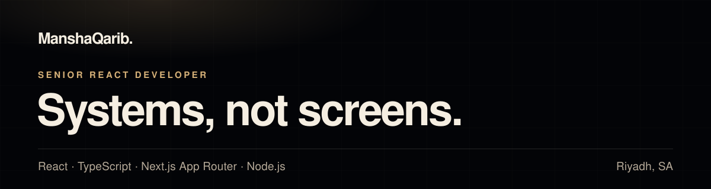

 

 

## The throughline

**The second screen is where it breaks.**

One screen is easy. The tenth is where duplication, drift and retrofitted
accessibility show up. That is the work.

Eight years of it — production frontends in React, TypeScript and Next.js:
component libraries and data-heavy dashboards for platforms serving **700+
financial institutions** and **100,000+ users**.

 

## Selected work

| Project | Discipline | Scale | |
| :--- | :--- | :--- | :--- |
| **[Halcyon](https://halcyonsolutions.ai)** | Fintech · Enterprise React | 700+ financial institutions · millions in filings | [Case study](https://manshaqarib.com/work/halcyon) |
| **[Ayshei](https://ayshei.com)** | Marketplace · GraphQL | 100k+ users · 4 verticals | [Case study](https://manshaqarib.com/work/ayshei) |
| **[Lappeland](https://lappeland.no)** | E-commerce · Next.js App Router | 2× traffic · ~95 Lighthouse | [Case study](https://manshaqarib.com/work/lappeland) |
| **[SnapDebt](https://snapdebtrecovery.com)** | Fintech · Workflow automation | 10,000+ businesses · 30% faster | [Case study](https://manshaqarib.com/work/snapdebt) |
| **[Global Shopaholic](https://globalshopaholics.com)** | E-commerce · Vue & Laravel | Spec to deployment, solo | — |
| **[JACOBS Drycleaners](https://jacobsdrycleaners.co.uk)** | Service booking · Nuxt & Laravel | Two audiences, one system | — |
| **Neonbit** | SaaS · Security & RBAC | Permissions model as the product | [Case study](https://manshaqarib.com/work/neonbit) |

Metrics are the real figures only. A project with none carries none.

 

## How I work

| | |
| :--- | :--- |
| **Frontend architecture** | Rendering strategy chosen per route, not per app. |
| **Component systems** | Built once, documented in Storybook, composed after. |
| **Accessibility** | WCAG 2.1 AA specified up front, then tested. |
| **Performance** | Core Web Vitals, budgeted and measured. |

> Real primitives · Typed boundaries · WCAG 2.1 AA · Measured budgets · Fewer re-renders · Rendering per route

 

## Stack

**Core**

**Backend & data**

**Platform**

 

## Experience

| | | |
| :--- | :--- | :--- |
| **Independent** | Senior Frontend Engineer | Upwork Top Rated Plus. Four concurrent engagements across e-commerce, SaaS, fintech and healthcare, owning frontend architecture end to end. |
| **Carbonic IT Solutions** | Web Developer | Client applications from Figma to production for US and UK clients, working directly with non-technical stakeholders. |
| **VisionX** | Frontend Engineer | Three years across Halcyon, Ayshei and Morta — enterprise React, GraphQL and the reusable primitives underneath them. |
| **Dixeam Inc** | Developer & Team Lead | SnapDebt and Moonrock on React, Node and Laravel. Led a small team and cut page load times by 30%. |

 

## Perspective

> **Decide the rendering before the layout.**
>
> Pick the data boundary. Name the accessibility contract. Set the performance
> budget. Then the component is obvious.

> *A component is done when the next screen can be assembled from it instead of
> written again.*

 

## Activity

 

## Elsewhere

**[manshaqarib.com](https://manshaqarib.com)** · **[LinkedIn](https://linkedin.com/in/manshaqarib)** · **[mansha.qarib777@gmail.com](mailto:mansha.qarib777@gmail.com)** · Riyadh, Saudi Arabia

Building something that has to scale? Get in touch.
